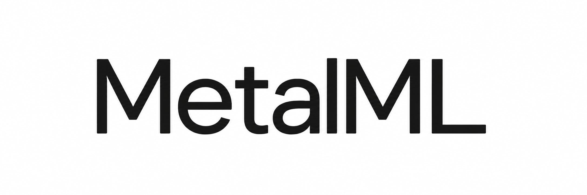

<p align="center">
  <picture>
    <source media="(prefers-color-scheme: dark)" srcset="assets/metalml-wordmark-wide-dark.png">
    <source media="(prefers-color-scheme: light)" srcset="assets/metalml-wordmark-wide-light.png">
    
  </picture>
</p>

# MetalML: GPU-Accelerated Machine Learning for Apple Silicon

[](pyproject.toml)
[](#scikit-learn-compatibility)
[](#how-metalml-uses-the-gpu)
[](LICENSE)

**Your scikit-learn workflow. Your Mac's GPU.**

MetalML is an open-source machine learning library that brings Metal GPU
acceleration to familiar scikit-learn workflows. Designed for Apple Silicon,
it combines native Metal compute kernels and Metal Performance Shaders with
scikit-learn's estimator interface.

Change your imports to `metalml`, keep using `fit`, `predict`, and `transform`,
and let supported operations use the GPU. Unsupported estimators and
configurations continue through scikit-learn on the CPU.

[Quick start](#quick-start) · [Installation](#installation) ·
[Supported algorithms](#supported-algorithms) · [Compatibility](#scikit-learn-compatibility) ·
[Contributing](#contributing)

## Quick start

Fit a regression model using the same interface you already know:

```python
import numpy as np
import metalml as ml

# Dense float32 data is eligible for Metal acceleration.
rng = np.random.default_rng(42)
X = rng.normal(size=(10000, 64)).astype(np.float32)
y = 2 * X[:, 0] - X[:, 1]

model = ml.linear_model.Ridge(alpha=1.0)
model.fit(X, y)
predictions = model.predict(X[:100])

# Inspect which operations used Metal or CPU.
print(model.operation_backends_)
```

## Accelerate an existing scikit-learn workflow

For code that accesses scikit-learn through one module alias, change one import:

```diff
- import sklearn as ml
+ import metalml as ml
```

For direct imports, change the package prefix:

```python
from metalml.preprocessing import StandardScaler
from metalml.linear_model import Ridge
from metalml.pipeline import make_pipeline

pipeline = make_pipeline(StandardScaler(), Ridge(alpha=1.0))
pipeline.fit(X, y)
predictions = pipeline.predict(X[:100])
```

MetalML preserves familiar estimator parameters and integrates with sklearn
pipelines, cloning, cross-validation, grid search, and pandas output. Existing
`sklearn` imports and previously created estimators are not modified. Each
operation makes its own backend choice; a pipeline can include both CPU and GPU
steps.

## Supported algorithms

MetalML covers preprocessing, clustering, regression, classification,
dimensionality reduction, and nearest-neighbor workflows. GPU support depends
on the operation and its configuration.

| Algorithms | Metal acceleration | Work that remains on CPU |
| --- | --- | --- |
| StandardScaler, MinMaxScaler, Normalizer | Statistics, scaling, normalization | Incremental fitting and unsupported settings |
| KMeans | Initialization distances, Lloyd iterations, prediction, distances | Seed sampling and iteration control |
| Ridge | Gram/cross-products, prediction | Condition checks and linear-system solve |
| Linear regression and classification families, linear SVMs | Linear scores and prediction | Training; output conversion where needed |
| PCA | Eligible covariance computation, projection, inverse projection | Eigensolver and other fitting configurations |
| TruncatedSVD | Projection and inverse projection | Training |
| MLPClassifier, MLPRegressor | Dense layers and activations | Training and label decoding |
| GaussianNB, MultinomialNB, BernoulliNB, ComplementNB | Likelihood scores | Training and probability normalization |
| DecisionTree, ExtraTree, RandomForest, ExtraTrees | Tree traversal and forest averaging | Training and label decoding |
| SVC, NuSVC, SVR, NuSVR, OneClassSVM | Kernel scores | Training, voting, calibrated SVC probabilities |
| NearestNeighbors, KNeighborsClassifier, KNeighborsRegressor | Exact Euclidean distances and top-k selection | Index storage, classification votes, regression aggregation |
| LinearDiscriminantAnalysis | Decision scores | Training and probability conversion |

Other public estimators and utilities are provided by the installed scikit-learn.

<details>
<summary>Operation requirements and fallback conditions</summary>

- **Input:** GPU operations use dense float32 arrays. Sparse inputs and
  precision-preserving float64/integer inputs use sklearn.
- **Scaling:** Weighted StandardScaler and incremental scaler fitting use CPU.
- **KMeans:** GPU fitting supports Lloyd iterations. Elkan, callable
  initialization, verbose mode, nonpositive weights, and empty-cluster
  relocation use sklearn.
- **Ridge:** GPU fitting requires scalar positive alpha, `auto` or `cholesky`,
  no sample weights or positivity constraint, at most 2,048 features, and at
  least as many samples as features. Ill-conditioned systems use sklearn.
- **PCA:** GPU covariance fitting requires `auto`/`covariance_eigh`, `copy=True`,
  integer or `None` component counts, at most 1,000 features, and at least ten
  times as many samples as features. Poorly conditioned covariance uses sklearn.
- **Trees and forests:** Missing values and multi-output classification use
  sklearn. Single- and multi-output regression are supported.
- **Kernel SVMs:** `linear`, `rbf`, `poly`, and `sigmoid` are supported. Callable,
  precomputed, and sparse kernels use sklearn.
- **Neighbors:** GPU search requires a fitted brute-force Euclidean search with
  at most 32 neighbors. Other metrics, tree indexes, sparse inputs, and
  self-excluding `X=None` queries use sklearn. Equal-distance GPU ties use the
  lowest reference index; sklearn ordering can differ.

</details>

## Installation

From a checkout of this repository, create an environment and install:

```sh
python3 -m venv .venv
source .venv/bin/activate
python -m pip install --upgrade pip
python -m pip install .
```

| Requirement | Details |
| --- | --- |
| Python | 3.10 or later; 3.12 recommended |
| scikit-learn | 1.6.x or 1.7.x; installed as a dependency |
| GPU execution | macOS with a compatible Metal GPU |
| Apple Silicon | Use native ARM64 Python and a fresh environment |
| Metal bindings | PyObjC Metal and Metal Performance Shaders; installed automatically on macOS |

The package includes its Metal shader source, which compiles for the selected
GPU on first use. Later operations reuse compiled pipelines. Installation does
not require CUDA, PyTorch, MLX, or a separate Xcode project.

**Hardware status:** MetalML is experimental. Apple Silicon is the target
platform; physical Apple Silicon validation and performance tuning are still
pending. GPU execution has been verified on an Intel Mac with an AMD Radeon Pro
5300M. Other operating systems use sklearn CPU fallback.

## Scikit-learn compatibility

MetalML supports sklearn 1.6.x and 1.7.x. Public modules and unimplemented classes
forward to sklearn. Private imports such as `metalml.cluster._kmeans` are outside
the compatibility surface, and sklearn's internal estimator factories are not
patched.

GPU support is partial: many estimators accelerate inference while retaining
sklearn training. Metal uses float32 arithmetic, so results can differ slightly
from CPU output. Reductions, tied distances, and margins near a classification
boundary can also change labels or clustering outcomes.

NumPy commonly creates float64 arrays. Convert to float32 when appropriate, or
explicitly allow MetalML to convert eligible inputs:

```python
ml.set_config(precision="float32")
```

The default preserves input precision through CPU fallback. Sparse matrices are
never silently converted into dense GPU arrays.

## Choose and inspect the backend

Automatic dispatch is enabled by default. You can select the backend per block:

```python
with ml.config_context(backend="cpu"):
    reference = ml.linear_model.Ridge().fit(X, y)

with ml.config_context(backend="metal"):
    accelerated = ml.linear_model.Ridge().fit(X, y)

print(ml.backend_info())
print(accelerated.operation_backends_)
print(accelerated.fallback_reasons_)
```

Strict Metal mode raises `MetalUnavailableError` when an implemented GPU
operation must fall back. Documented CPU training and forwarded sklearn
estimators remain CPU operations. Shader compilation and GPU execution failures
raise explicitly.

`METALML_BACKEND=cpu` disables GPU dispatch, including in worker processes.
Backend diagnostics are available on MetalML wrappers; forwarded sklearn
classes retain their original interface.

## How MetalML uses the GPU

MetalML uses tiled compute kernels, fused operations, reusable buffers, and
Metal Performance Shaders to accelerate supported numerical work. Ridge and
PCA combine GPU matrix products with CPU solvers; other families share GPU
prediction primitives.

Performance depends on the model, dataset, and device. Small operations can be
faster on CPU. Automatic mode includes fixed CPU/GPU selection rules measured
on the Radeon Pro 5300M; these rules are not calibrated for Apple Silicon.
Benchmark your own workload before assuming a speedup.

Estimator boundaries return NumPy arrays. An entire pipeline is not kept on the
GPU. Shared and device-local storage caches are each bounded at 64 MiB, with
additional memory needed for active inputs, outputs, and workspaces. GPU work
within one process is serialized; use spawn/loky instead of forking a process
after Metal initialization.

## Save and load models

Use `pickle` or `joblib` with MetalML estimators. Saved models hold NumPy state
rather than GPU handles, and MetalML must be installed when loading them.
Only load serialized models from trusted sources.

## Build from source

```sh
python -m pip install -e '.[dev]'
python -m build
```

## Contributing

[Open an issue](https://github.com/tudor-22/MetalML/issues) for bugs, compatibility
reports, or feature requests. Include the MetalML and sklearn versions, Mac
model, output of `ml.backend_info()`, and a minimal example.

Areas for contribution include Apple Silicon validation and tuning, GPU
training for more estimators, sparse algorithms, and keeping data on the GPU
across pipeline steps. Performance contributions should compare complete
operations with sklearn on the same hardware and include numerical checks.

## License

MetalML is available under the [Apache License 2.0](LICENSE).
An independent project, unaffiliated with Apple, NVIDIA, or scikit-learn.
